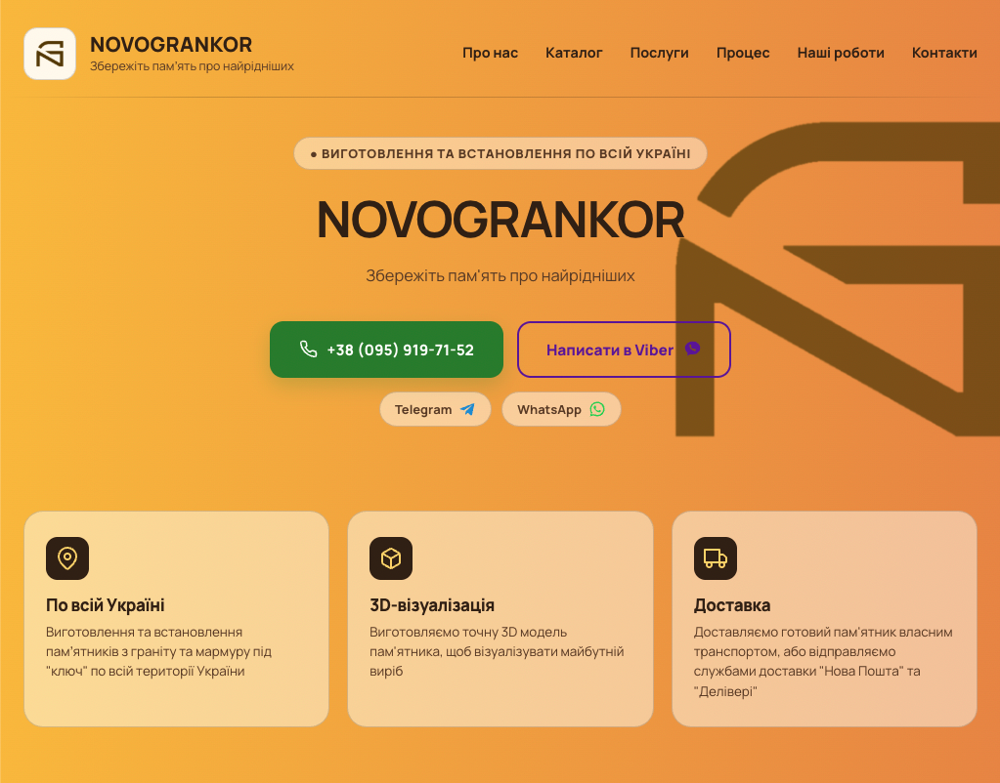
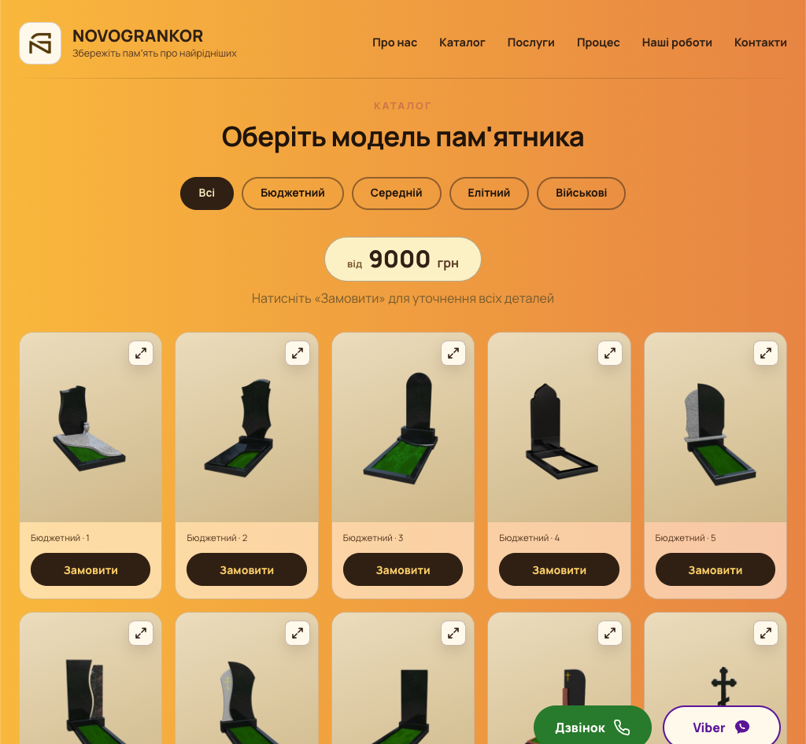
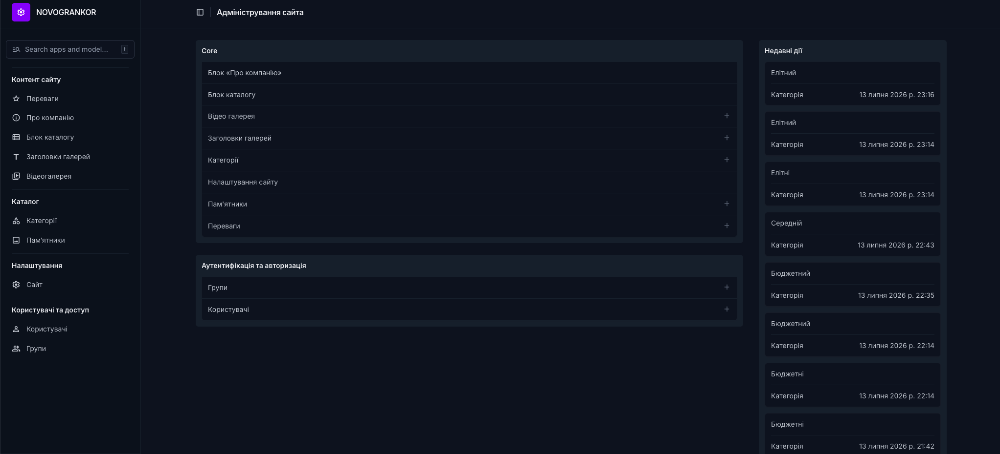

# NOVOGRANKOR

Комерційний вебсайт компанії NOVOGRANKOR, що спеціалізується на виготовленні та встановленні пам'ятників із натурального граніту.

🌐 **Live:** https://novogrankor.com

Проєкт розроблений на Django як CMS-рішення, де весь контент сайту керується через адміністративну панель.


## Preview

### Головна сторінка



### Каталог



### Адмінпанель




## Live Demo

🌐 https://novogrankor.com


## Production

Production environment:

- PythonAnywhere
- Custom domain
- HTTPS (Let's Encrypt)
- WhiteNoise
- Environment variables (.env)

## Функції

- Адаптивний макет
- Керування контентом на основі CMS
- Каталог продукції
- Відеогалереї
- SEO-налаштування
- Керування контактною інформацією
- Адміністрування Django Unfold
- Завантаження зображень
- Розгортання HTTPS

## Tech Stack

- Python 3.11
- Django 5
- Django Unfold
- SQLite
- WhiteNoise
- Pillow
- python-decouple
- dj-database-url
- HTML5
- CSS3
- JavaScript


```
NOVOGRANKOR/
│
├── config/
├── core/
├── media/
├── static/
├── templates/
├── requirements.txt
├── manage.py
└── README.md
```

## CMS-структура

### Контент сайту

* `Advantage` — переваги на головній сторінці
* `AboutSection` — блок “Про компанію”
* `AboutStat` — статистика в блоці “Про компанію”
* `CatalogSection` — заголовки, підказки та порожні стани каталогу
* `GallerySection` — заголовки секцій “Процес” і “Наші роботи”
* `Gallery` — відео для секцій галереї

### Каталог

* `Category` — категорії памʼятників
* `Monument` — памʼятники всередині категорій

### Налаштування

* `SiteSettings` — глобальні налаштування сайту:

  * назва сайту
  * логотип
  * favicon
  * hero-тексти
  * CTA-тексти
  * телефон
  * email
  * Viber
  * Telegram
  * WhatsApp
  * соцмережі
  * SEO
  * footer-тексти

## Наповнення адмінки

Після першого запуску потрібно заповнити основні CMS-блоки.

### 1. Налаштування сайту

Створи один запис `SiteSettings`.

Заповни:

* назву сайту
* логотип
* favicon
* телефон
* Viber / Telegram / WhatsApp
* Hero-тексти
* CTA-тексти
* SEO-тексти
* footer-тексти

### 2. Переваги

Створи записи `Advantage`, наприклад:

1. По всій Україні
2. 3D-візуалізація
3. Доставка

Для кожної переваги можна вказати іконку, порядок і статус активності.

### 3. Блок “Про компанію”

Створи один запис `AboutSection`.

Додай:

* заголовок
* основні тексти
* ліву картку
* зображення
* статистику через inline `AboutStat`

Приклади статистики:

* `10+` — років досвіду
* `500+` — встановлених виробів

### 4. Блок каталогу

Створи один запис `CatalogSection`.

Він керує:

* міткою секції
* заголовком каталогу
* загальною ціною “від”
* підказкою під ціною
* текстом “Ціна уточнюється”
* текстами порожніх станів

### 5. Категорії та памʼятники

Створи категорії через `Category`.

Потім додай памʼятники через `Monument`.

Для кожного памʼятника можна вказати:

* категорію
* назву
* зображення
* alt-текст
* порядок
* активність

### 6. Заголовки галерей

Створи два записи `GallerySection`:

1. `Процес`
2. `Наші роботи`

Вони керують заголовками та підзаголовками відеосекцій.

### 7. Відеогалерея

Через `Gallery` додай відео для секцій:

* `process`
* `works`

Для кожного відео можна вказати:

* назву
* секцію
* відеофайл
* постер
* порядок
* активність

## Тести

Запуск усіх тестів:

```bash
python manage.py test
```

Перед кожним комітом бажано запускати тести та перевіряти, що всі проходять.

## Адмінпанель

У проєкті використовується Django Unfold.

Адмінпанель має логічну навігацію:

### Контент сайту

* Переваги
* Про компанію
* Блок каталогу
* Заголовки галерей
* Відеогалерея

### Каталог

* Категорії
* Памʼятники

### Налаштування

* Сайт

### Користувачі та доступ

* Користувачі
* Групи

## Робота з медіафайлами

Зображення та відео завантажуються через Django Admin.

Локально медіафайли зберігаються в директорії:

```text
media/
```

## Моя роль

Цей проєкт було розроблено самостійно.

Обов'язки:

- Розробка бекенду (Django)
- Проектування баз даних
- Архітектура CMS
- Налаштування адміністратора Django
- Розгортання
- Підтримка продакшену
- Покращення інтерфейсу користувача
- SEO-конфігурація